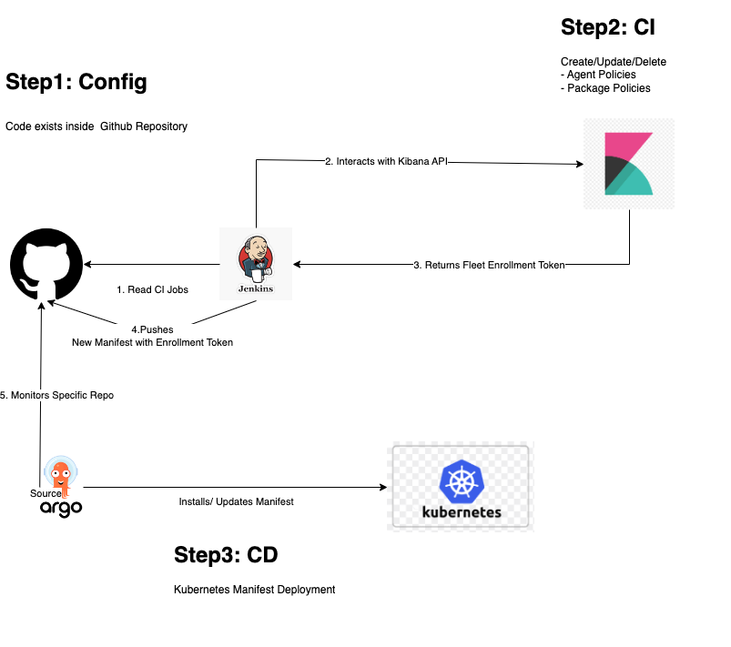

# Installation Guide

Purpose of this document is to facilitate the automation deployment of our Kubernetes Observability Integration Solution. 

In more details, proposes  a GitOps approach to install the [Elastic Agent](https://www.elastic.co/guide/en/fleet/current/elastic-agent-container.html) with [Kubernetes Integration](https://docs.elastic.co/en/integrations/kubernetes) enabled and monitor a given Kubernetes Cluster.

This document summarizes the needed steps to install the CI/CD tools used in order to create the Infrastructure proposed below. Main goals to achieve:
- All configuration should exist in a Github Repository
- CRUD actions (Create, Update, Delete) should be supported as part of this Proof of Concept (POC)
- No manual execution steps.  All steps should be performed from relevant automation

## Infrastructure

For the needs of this POC we have installed all tools locally. For CI (Continuous Integration) tool we used Jenkins. Jenkins will be responsible to read specific Github repository and perform needed operations to Elastic Stack. For CD (Continuous Deployment) part we propose ArgoCD. ArgoCD will be responsible to ultimately install the final produced Elastic Agent manifest into a given Kubernetes Cluster

Below schema explains the logical flow of our actions:



Jenkins leverages [Kibana API](https://www.elastic.co/guide/en/kibana/master/api.html) in order to configure our Elastic Stack

For the needs of this automation we have deployed Python Script [here](https://github.com/elastic/observability-dev/blob/main/docs/infraobs/cloudnative-monitoring/testing/api-kubernetes-automation.md). This script is responsible to run the actual Kibana API requests.

Additional Python script [converter_yaml_json.py](./converter_yaml_json.py) offers the ability to the users to provide Yaml declarative configuration. The script will transform then the Yaml provided input to Json ready to be consumed by Kibana API.

## Deployment

### Pre-requisites:

Install following tools:
- [Kind](https://kind.sigs.k8s.io/)  
- [Docker](https://docs.docker.com/engine/install/)
- [Kubectl](https://kubernetes.io/docs/tasks/tools/) 
- [Elastic-Package](https://github.com/elastic/elastic-package) 


### Installation steps
1. Deploy Kubernetes Cluster
    ```bash
    kind create cluster --name argocd
    ```

2. [Deploy ArgoCD](https://argo-cd.readthedocs.io/en/stable/operator-manual/installation/) inside your new K8s cluster

    To access ArgoCD locally run:
    ```bash
    kubectl port-forward -n argocd svc/argocd-server 8381:443
    ```

    After this step you should be able to access ArgoCD Locally under http://localhost:8381/ 

    To retrieve admin password of ArgoCD:
    ```bash
    kubectl -n argocd get secret argocd-initial-admin-secret -o jsonpath="{.data.password}" | base64 -d && echo
    ```

3. Deploy Jenkins in as a local Docker Container

    ```bash
    docker image pull jenkins/jenkins:lts
    docker volume create jenkinsvolume
    docker container run -d -p 8082:8080 \
    -u root \
        -v /var/run/docker.sock:/var/run/docker.sock \
        -v jenkinsvolume:/var/jenkins_home \
        -v $(which docker):/usr/bin/docker \
        --privileged \
        --name jenkins-local \
        jenkins/jenkins:lts
    ```

    After this step you should be able to access Jenkins Locally under http://localhost:8082/ 

    To retrieve the admin password run below commands:
    ```bash
    docker container exec <ID of jenkins-local container> \
    sh -c "cat /var/jenkins_home/secrets/initialAdminPassword"
    ```

4. Deploy Elastic Stack
    ```bash
    elastic-package stack up -d -vvvv --version=8.5.0
    ```

5. Connect Elastic Stack with Jenkins network
    ```bash
    docker network connect elastic-package-stack_default jenkins-local
    ```

## Configuring Components

### Elastic Stack

Once your Elastic Stack is ready we need to configure an Elastic Authentication token in order to be able to interact with Kibana API.

Prerequisite is to create a valid APiToken able to perform fleet operations. Login to Elastic Kibana Management and navigate to **Menu > Management > Dev Tools**:

Make sure you create the following security Apikey:

```bash
POST /_security/api_key
{
  "name": "test",
  "role_descriptors": {
    "test": {
    "cluster": [],
    "indices": [],
    "applications": [
      {
        "application": "kibana-.kibana",
        "privileges": [
          "feature_fleet.all",
          "feature_fleetv2.all"
        ],
        "resources": [
          "*"
        ]
      }
    ]}
  }
}
```

Save above `Kibana API Token` for later use

### Jenkins

Jenkins need to be able to run python script that will actually run the Kibana API commands. Make sure that you have installed the following in your jenkins worker docker container 

```bash
❯ docker exec -it -u root jenkins-local bash
apt update
apt install python3.9
apt install pip
pip3 install pyyaml
pip3 install requests
```

Once installation is complete you can be able to configure your CI jobs inside Jenkins. Relevant files have been provided here for `Jenkinsfile_install_agent`, `Jenkinsfile_update_agent` and `Jenkinsfile_delete_agent` scenarios
For more information if you want to configure Jenkins with Github SCM [here](https://www.cprime.com/resources/blog/how-to-integrate-jenkins-github/)

Additionally you need to create the following two Credentials into your Jenkins Credential store. Both can be stored as normal UsernamePassword credentials. Our Jenkins samples make use of `WithCredentials` Plugin to read the provided credentials:
- Github Token: We need this token in order Jenkins to be able to push and open PRs in your Github Repository. We need Jenkins to be able to push files in a given Github Branch because finally we need the new Elastic Agent  Manifest to be created. To create a Personal Access Token read [here](https://docs.github.com/en/authentication/keeping-your-account-and-data-secure/creating-a-personal-access-token). For the needs of this POC `repo, admin:repo_hook and user scopes` need to be allowed.
- Elastic Token: Needed in order Jenkins to authenticate to Kibana API. Use  `Kibana API Token` of previous step


### ArgoCD 

ArgoCD needs no extra configuration. Just create a sample Application that monitors your Github Folder for creation of new Manifests. `Jenkinsfile_install_agent` is the sample CI Jenkins job that will create the Elastic Agent Manifest


